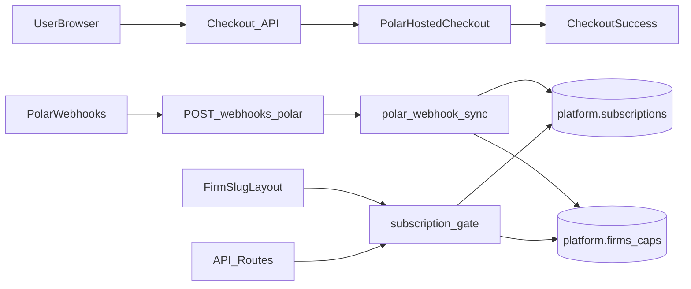

# Subscription HLD — Polar + Firma

**Companion:** [Subscriptions PRD](prd-subscriptions.md) (Polar contract + commercial plan content). **This HLD** covers only the **technical** flow (checkout → webhooks → DB), not duplicate product requirements.

## Overview

Checkout is Polar-hosted; subscription lifecycle updates arrive via webhooks and are written to **`platform.subscriptions`**. **`platform.firms`** stores billing **policy** (caps, billing-group pointers), not duplicate Polar subscription columns.

## Architecture



## Components

| Area | Path | Responsibility |
| --- | --- | --- |
| Checkout | `frontend/app/api/checkout/...` | Auth, firm membership, `customerExternalId = firmId`, Polar session |
| Webhook | `frontend/app/api/webhooks/polar/route.ts` | Signature verify, delegate to sync |
| Sync | `frontend/lib/billing/polar-webhook-sync.ts` | Parse payload, resolve firm → **anchor**, upsert **`subscriptions`**, deactivate other active rows when needed, refresh JWT/caps hooks |
| Active row lookup | `frontend/lib/billing/active-billing-subscription.ts` | `getActiveSubscriptionForFirm`, Polar ID → `firmId` resolution |
| Billing anchor | `frontend/lib/billing/billing-group.ts` | `resolveBillingAnchorFirmId` / `getFirmRowForBillingGate`; satellites inherit access from anchor |
| Subscription gate | `frontend/lib/billing/subscription-gate.ts` | `checkFirmSubscriptionAccess` (bool) + `assertFirmSubscriptionAccess` (throws 403); fail-open on DB error |
| Hard lock — pages | `frontend/app/(app)/d/f/[slug]/layout.tsx` | Server layout: redirects locked firms to `/subscription-locked`; skips check on the locked page itself |
| Hard lock — APIs | Individual API routes | `assertFirmSubscriptionAccess` called after permission checks; throws `SubscriptionRevokedError` (403) |
| Locked page | `frontend/app/(app)/d/f/[slug]/subscription-locked/page.tsx` | Shown when subscription is revoked; data-safe messaging, reactivate CTA |

## Data model (billing-relevant)

**`platform.subscriptions`** (per firm id; one logical "active" row enforced in app + partial unique index):

- `plan`, `pricingModel`, `currentPeriodEnd`, `scheduledCancelAt`
- `polarCustomerId`, `polarSubscriptionId`, `polarOrderId`, `provider`, `active`, `deactivatedAt`, `settings` (JSON)

`scheduledCancelAt` — set when Polar fires `subscription.canceled` with a future `ends_at` (scheduled end-of-period cancel). The subscription remains `active: true` until `subscription.revoked` arrives. Cleared to `null` on `subscription.uncanceled` and `subscription.revoked`.

**`platform.firms`** (anchor and satellites):

- **Not** storing subscription status / Polar IDs on the firm row.
- **Caps / grouping:** e.g. `billingActiveEngagementCap`, `billingGroupFirmCap`, `billingCapsLocked`, `sandboxOnly`, `anchorFirmId`, etc.

## Subscription gate — access rules

`checkFirmSubscriptionAccess(firmId)` returns `true` (access granted) when **any** of:

1. `ENFORCE_BILLING_GATES` env var is not `'true'` (dev bypass)
2. DB error resolving the firm — **fail-open**, never false-lock
3. Firm not found in DB — **fail-open**
4. Anchor firm has `sandboxOnly: true`
5. Anchor's subscription status is `active`, `trialing`, or `past_due`

Returns `false` (access denied) only when billing is enforced **and** the subscription status is definitively `canceled`, `unpaid`, or `none`.

Satellites resolve to their anchor firm before the status check. A satellite with a healthy anchor is always accessible.

## Event → DB state (handler)

| Polar event | Condition | `active` | `scheduledCancelAt` | Post-sync hooks |
| --- | --- | --- | --- | --- |
| `subscription.created` | — | `true` | unchanged | revoke duplicate free tier |
| `subscription.updated` | status ≠ canceled | `true` | unchanged | revoke duplicate free tier |
| `subscription.updated` | status = canceled | `false` | unchanged | resync sandbox free plan, refresh billing |
| `subscription.active` | — | `true` | unchanged | revoke duplicate free tier |
| `subscription.canceled` | `ends_at` ≥ now | `true` | set to `ends_at` | revoke duplicate free tier, create cancellation reminders |
| `subscription.canceled` | `ends_at` past/null | `false` | `null` | resync sandbox free plan, refresh billing |
| `subscription.uncanceled` | — | `true` | `null` (cleared) | revoke duplicate free tier, clear cancellation reminders |
| `subscription.revoked` | — | `false` | `null` (cleared) | resync sandbox free plan, refresh billing, clear cancellation reminders |

**Key invariants:**

- `subscription.revoked` is the authoritative deactivation signal for scheduled cancellations. `subscription.canceled` with a future `ends_at` only schedules — it does not revoke access.
- `scheduledCancelAt` is only written to the DB when the caller **explicitly** passes it (including `null` to clear). Handlers that don't pass it (e.g. `subscription.updated`) preserve the existing DB value.
- No background job (Inngest) is needed for scheduled-cancel expiry; Polar delivers `subscription.revoked` at period end.

## Hard lock enforcement

When `ENFORCE_BILLING_GATES=true`, access is blocked at two layers:

**Layer 1 — Page navigation** (`FirmSlugLayout`):

- Runs on every server render under `/d/f/[slug]/`
- Resolves slug → firmId → calls `checkFirmSubscriptionAccess`
- Locked: redirects to `/d/f/[slug]/subscription-locked`
- The locked page itself is excluded from the check (via `x-invoke-path` header set by `proxy.ts`) to prevent redirect loops
- Fails open on DB error or missing firm — never false-locks

**Layer 2 — Direct API calls** (individual routes):

- `assertFirmSubscriptionAccess(firmId)` called after permission checks in mutation routes
- Throws `SubscriptionRevokedError` → caught per-route → `403 { code: "subscription_revoked" }`
- Currently enforced on: `DELETE /projects/[id]/documents/[id]`, `PUT/DELETE /documents/[id]/sharing`, `GET /firms/[id]/admins`

## Billing group / satellite model

```text
AnchorFirm (has subscription)
  └── SatelliteFirm A  (anchorFirmId → AnchorFirm.id)
  └── SatelliteFirm B
```

- Gate always resolves satellite → anchor before checking status
- `sandboxOnly: true` on the anchor means all satellites pass unconditionally
- Adding a satellite to a group with an active subscription grants access immediately (no webhook needed)

## Environment

- `POLAR_ACCESS_TOKEN`, `POLAR_SERVER`, `POLAR_WEBHOOK_SECRET`, success URL envs as in app config.
- `ENFORCE_BILLING_GATES=true` must be set in production to activate the hard lock.
- Separate Polar org + secrets per environment.

## Security

- Checkout: authenticated user + firm membership.
- Webhook: signature verification only (no session).
- Hard lock: server-side only — no client-side bypass possible via bookmarked URLs.
- Tokens server-side only.

## Observability

- `[subscription-gate]` structured log prefix for all gate decisions (warn on deny, error on DB failure).
- `polar-webhook-sync` logs every sync at `info` level with firm id, subscription id, resolved status.
- `SubscriptionRevokedError` logged at `info` (expected business logic, not a server fault).

## Deploy checklist

- [ ] `ENFORCE_BILLING_GATES=true` set in production environment
- [ ] Migration `20260604100000_multi_connector_schema_rename` applied — renames `googlePermissionId → connectorPermissionId`. Drain Inngest queue before applying if jobs are in flight.
- [ ] Verify sandbox firm (`sandboxOnly: true`) is accessible after deploy
- [ ] Verify active paid firm is accessible after deploy
- [ ] Verify `subscription.revoked` webhook clears `scheduledCancelAt` (check DB row after firing)

## Test plan

1. Sandbox checkout for a known firm admin → verify `platform.subscriptions` row for anchor `firmId`.
2. Replay webhook → confirm idempotent (no duplicate rows, no status flip).
3. Set `ENFORCE_BILLING_GATES=true` locally; set subscription `active: false` in DB → navigate to firm → confirm redirect to `/subscription-locked`.
4. Attempt direct API call (`DELETE /documents/[id]`) with locked firm → confirm `403 subscription_revoked`.
5. Navigate to `/d/f/[slug]/subscription-locked` directly → confirm page renders (no redirect loop).
6. Sandbox/anchor firm with `sandboxOnly: true` + `active: false` → confirm full access.
7. Satellite firm whose anchor has `active: true` → confirm full access.
8. Set `active: true` in DB → confirm access restored immediately (no restart needed).
9. Fire `subscription.canceled` with future `ends_at` → confirm `scheduledCancelAt` set, `active: true`.
10. Fire `subscription.revoked` → confirm `active: false`, `scheduledCancelAt: null`, lock page shown.
11. Fire `subscription.uncanceled` → confirm `active: true`, `scheduledCancelAt: null`, access restored.
